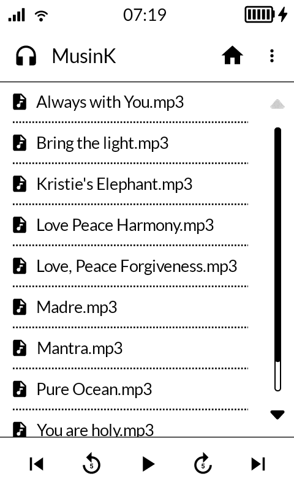

Music player for E-ink screens. Makes use of [Mudita Mindful Design](https://zeroheight.com/956ff055a/p/79359a-mudita-mindful-design).

No music file scanning and mp3 tag shenanigans. Just pure old-school files and directories bliss.

This app will ask for external storage permission and bluetooth permission. The Bluetooth permission doesn't actually mention bluetooth, but nearby devices and location.

The app icon (left to the MusinK label) connects to your (already paired) bluetooth devices.

